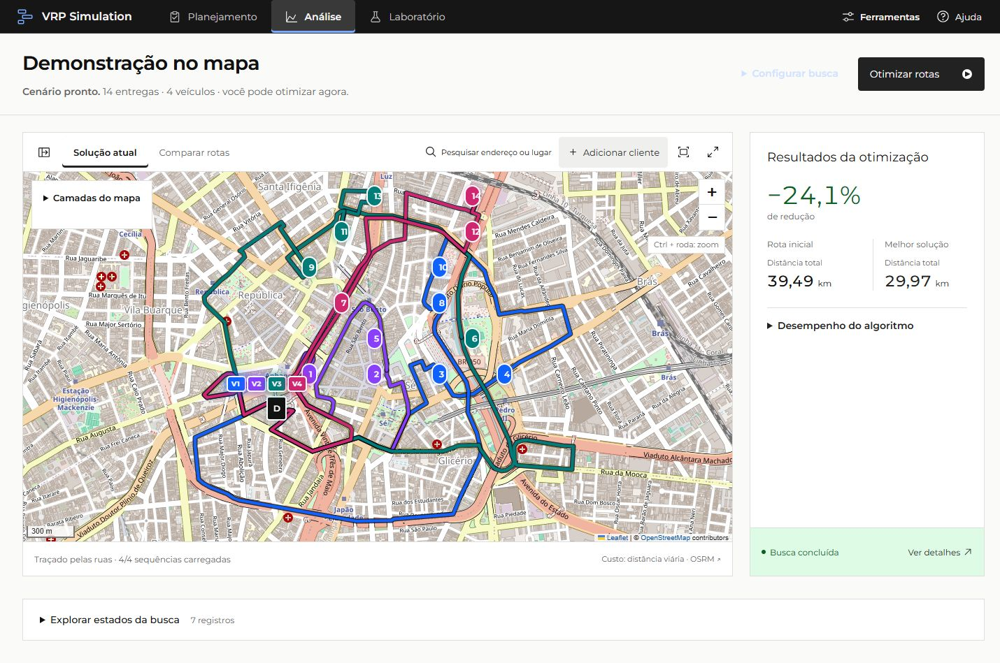
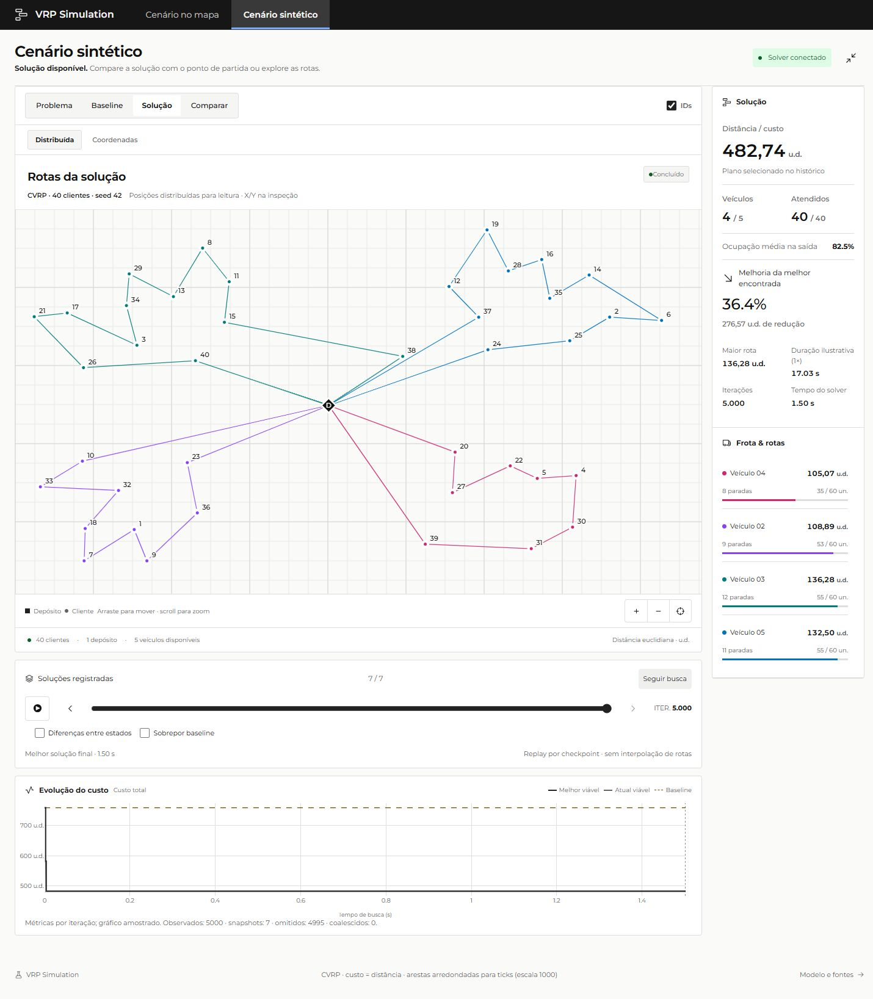

# VRP Simulation

Simulador de roteamento de veículos com capacidade limitada (CVRP), usando OR-Tools e PyVRP. Tem um cenário no mapa e um laboratório com geração e importação de instâncias VRP. As buscas são heurísticas, sem certificado de ótimo global.



*Cenário no mapa com dados sintéticos.*



*Laboratório sintético na vista distribuída.*

## Executar

Use Python 3.12 e Node.js 24. Na pasta que contém `backend` e `frontend`:

```powershell
python -m venv .venv
.venv\Scripts\python.exe -m pip install -r backend/requirements.txt
npm.cmd ci --prefix frontend
.venv\Scripts\python.exe -m uvicorn backend.app.main:app --host 127.0.0.1 --port 8000
```

Em outro terminal, na mesma pasta:

```powershell
npm.cmd run dev --prefix frontend
```

Abra [http://127.0.0.1:5173](http://127.0.0.1:5173). A API tem documentação em [http://127.0.0.1:8000/docs](http://127.0.0.1:8000/docs). Use um único worker na API. O histórico SQLite fica em `data`; o diretório e o banco são criados automaticamente quando não existem.

## Testes

```powershell
.venv\Scripts\python.exe -m unittest discover -s backend/tests -v
npm.cmd test --prefix frontend
npm.cmd run build --prefix frontend
```

Instruções e escopo: [Testes](docs/TESTING.md).

O banco e as pastas `test-results/` permanecem locais e são ignorados pelo Git.

## Documentação

[API e limites](docs/API.md) · [Importação VRP](docs/VRP-IMPORT.md) · [Fixtures](backend/tests/fixtures/vrp/README.md) · [Recursos visuais](frontend/src/carbon/SOURCE.md).

O código próprio ainda não tem licença definida.
